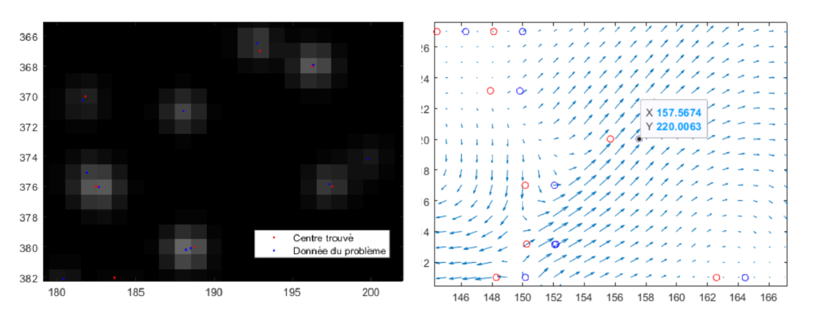

# Portfolio
---
## Deep Learning and Computer Vision

### Separating Latent Overlapped Fingerprints

**Company: IDEMIA**

**Oct 2021-Now**

Overlapped fingerprints are frequently encountered in latent fingerprints lifted from crime scenes. It is necessary to separate such overlapped fingerprints into component fingerprints so that existing fingerprint matchers can recognize them. In this project, we are trying to completely separate these fingerprints to provide two reconstructed fingerprints. We are currently basing our work on U-Net architecture, image augmentations, and some non trivial masks (geomtrics, ...). The database was generated with GAN to improve the learning of supervised algorithms.

 

**Bibliography:**

[1] Jianjiang Feng, Yuan Shi, Jie Zhou, "Robust and Efficient Algorithms for Separating Latent Overlapped Fingerprints", IEEE Transactions on Information Forensics and Security, vol. 7, no. 5, pp. 1498-1510, 2012. 
 
[2] Fanglin Chen, Jianjiang Feng, Anil K. Jain, Jie Zhou, and Jin Zhang, "Separating Overlapped Fingerprints", IEEE Transactions on Information Forensics and Security, vol. 6, no. 2, pp. 346-359, 2011. 

---
### Accident Anticipation and Risky Region Localization

A critical risk in autonomous vehicle is accident caused by an the external environment. Thus, we are investigating methods to anticipate risk and define a risky region localiztion. We are currently working on the work of [1] to implement their work and adapt it to aunomous vehicles. We use a dashcam database to train and test the performance of the algorithm. 

 

**Bibliography:**

[1] Zeng, K.-H. et al. (2017) ‘Agent-Centric Risk Assessment: Accident Anticipation and Risky Region Localization’, arXiv:1705.06560 [cs] [Preprint]. Available at: http://arxiv.org/abs/1705.06560 (Accessed: 3 November 2021).
 
[2] Jain, A. et al. (2016) ‘Brain4Cars: Car That Knows Before You Do via Sensory-Fusion Deep Learning Architecture’, arXiv:1601.00740 [cs] [Preprint]. Available at: http://arxiv.org/abs/1601.00740 (Accessed: 3 November 2021).

---
### Semi-supervised algorithms and image augmentations for the segmentation of satellite images

**Company: ONERA**

This research work was completed through an internship at ONERA and CNES (Aerospace Lab). My role was to complete research on semi-supervised learning algorithms to increase the performance ofthe identification of the buildings with a minimal database (Mean Teacher and Naive Student algorithms [1]). 
   
I wrote a private research paper about the experimental performance improvement with data augmentations methods such as Principal Component Analysis, Mixup, a custom mixof augmentations, and semi-supervised learning algorithms for complex data segmentation. I demonstrated that the use of Mean Teacher algorithm coupled with a random mix of non-trivial augmentation images, highly improved the robustness and the performance on segmentationfor large images: 30 % compared to supervised learning, and 13 % in a semi-supervised configuration without the random augmentations mix. 

 

**Bibliography:**

[1] Tarvainen, A. and Valpola, H. (2018) ‘Mean teachers are better role models: Weight-averaged consistency targets improve semi-supervised deep learning results’, arXiv:1703.01780 [cs, stat]. Available at: http://arxiv.org/abs/1703.01780 (Accessed: 2 August 2021)

[2] French, G. et al. (2020) ‘Semi-supervised semantic segmentation needs strong, varied perturbations’, arXiv:1906.01916 [cs]. Available at: http://arxiv.org/abs/1906.01916 (Accessed: 2 August 2021)

---

### Autonomous UAV: Dassault UAV Challenge

**Company: Dassault Aviation**

Competition gathering the best students in Europe. The UAV must carry out severalmissions. The first one is to automatically follow ground marking to reach a target. Thesecond one is that the UAV has to identify different targets according to the orders givenbeforehand (there are different forms and colors) and to deposit packages carefully. As Ilead the Artificial intelligence development of this project, I must coordinate the team. 
 
I developed forecasting and identifying methods to complete different tasks automatically, such as ground markers identification and parcel drop-off (YOLO method, non-linear optimization, gradient boosting, clustering...). To create the database, I generated artificial images with simulation software and python scripts. I enhanced the database by varying different external parameters (brightness to simulate an image taken at the end of the day...) of images to improve the diversity within the database.

 

**Bibliography:**

[1] Bochkovskiy, A., Wang, C.-Y. and Liao, H.-Y.M. (2020) ‘YOLOv4: Optimal Speed and Accuracy of Object Detection’, arXiv:2004.10934 [cs, eess] [Preprint]. Available at: http://arxiv.org/abs/2004.10934 (Accessed: 3 November 2021).

---
### Colorization Transformer by Google

The objective was to understand and implement the research paper [1]. Image colorization is a challenging, inherently stochastic task that requires a semantic understanding of the scene as well as knowledge of the world. Core immediate applications of the technique include producing organic new colorizations of existing image and video content as well as giving life to originally grayscale media, such as old archival images and videos.

 

**Bibliography:**

[1] Kumar, M., Weissenborn, D. and Kalchbrenner, N. (2021) ‘Colorization Transformer’, arXiv:2102.04432 [cs] [Preprint]. Available at: http://arxiv.org/abs/2102.04432 (Accessed: 1 September 2021).

---
### Image Inpaiting

mage inpainting focuses on the reconstruction of deteriorated images or when fillingmissing parts. This technique is used extremely often in images reconstitution because itallows to reconstitute historical images which have deteriorated. I principally studied the LASSO algorithm which is based on contraction of regression coefficients. and the ridgeregression. The linear regression consists in resolving: 

 

 

**Bibliography:**

[1] Bin Shen and Wei Hu and Zhang, Yimin and Zhang, Yu-Jin: Image Inpainting via Sparse Representation Proceedings of the 2009 IEEE International Conference on Acoustics, Speech and Signal Processing (ICASSP ’09)

---
### Particle Tracking 

The objective of the project was to study and numerically represent a flow around a cylinder using the principle of PTV. A camera with a laser was placed in front of the cylinder, the flow contains particles which do not influence the characteristics of the flow. Our role was to use images from the camera. By using the flow of the particle around the cylinder, we can use our mathematical and computing knowledge. The first step was to identify particles on each image from the film. The background being totally black, we can identify particles which are white. We used a correlation method based on neural networks. By means of weights, the method identifies the particles that resemble each other between two images. Then we infer vector fields

 

 

---
## Optimization
### Propeller optimization, airship UAV

The aim is to dimension a propeller from a dirigible-type drone intended for indoor aerial evolution, in the large ENSAM lecture hall. Initially, the drone will be a communication tool enabling images to be transmitted or carried autonomously and securely. Then, it can be modified to allow inspection or control of structures such as the vault of the large lecture hall. To respect these specifications the airship has to move extremely slowly because it will only be used as a communication tool. Due to the type of UAV (dirigible), the UAV has to move essentially thanks to the gas in the dirigible. Propellers are only here to begin the movement.
The aim is then to maximize the mechanical efficiency. I decided to develop a method to generate the most effective helix. By using using characteristic points from a blade I developed a parametric method by randomly modifying in a value interval the data of the helix.

 

 

 

---
### Heat Exchanger Optimization 

The objective of this project is to find a solution to recuperate the warmth coming out of a system which produces fumes at high temperature. The solution I found, was a creation of an exchanger to recuperate fumes to warm the air which entered  another system. The other system required air at the temperature of T=800K. I had to dimension my exchanger to respect size-specifications.
  
The objective is then, to achieve the most efficient exchanger possible. In a first step, I calculated the different coefficients governing the thermal transfer (DTLM method, NUT...) to complete a pre-dimensioning. To obtain an efficient thermal exchange between air and fumes, I created an exchanger geometry with the highest exchange surface between air and fumes. I developed my solution in CATIA. I finally simulated my model and analyzed our results under StarCCM+ (CFD software). According to results, we had to complete the dimensioning by determining the perfect dimensions, materials, and architecture to obtain the most optimized heat exchanger.

 

 

---
## Reinforcement Learning
### Lunar Landing 

This  project concerns the landing of a shuttle on the moon. The objective is to land the shuttle using reinforcement learning methods. We must then determine the most efficient policy possible in this environment and optimize the method. The reinforcement learning is based on the notion of reward and episode, the shuttle gains a reward when it approaches the landing zone, on the contrary, it loses its reward when it moves away from the zone. The episode ends when the shuttle crashes. I study the performance of policies (2C, PPO, DQN and QR-DQN) and optimize them with Optuna. I found that the PPO provide the best performance.

 

**Bibliography:**

[1] https://gym.openai.com/envs/LunarLander-v2/

---

© 2021 Yannis Montreuil Powered by Jekyll and the Minimal Theme.

