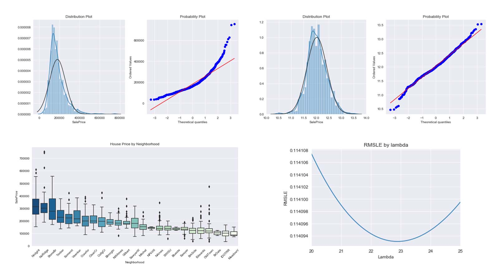

# Portfolio
---
## Deep Learning and Computer Vision

### Separating Latent Overlapped Fingerprints

**Company: IDEMIA**

Overlapped fingerprints are frequently encountered in latent fingerprints lifted from crime scenes. It is necessary to separate such overlapped fingerprints into component fingerprints so that existing fingerprint matchers can recognize them. In this project, we are trying to completely separate these fingerprints to provide two reconstructed fingerprints. We are currently basing our work on U-Net architecture, image augmentations, and some non trivial masks (geomtrics, ...). The database was generated with GAN, to improve the learning of supervised algorithms.

 

**Bibliography:**

[1] Jianjiang Feng, Yuan Shi, Jie Zhou, "Robust and Efficient Algorithms for Separating Latent Overlapped Fingerprints", IEEE Transactions on Information Forensics and Security, vol. 7, no. 5, pp. 1498-1510, 2012. 
 
[2] Fanglin Chen, Jianjiang Feng, Anil K. Jain, Jie Zhou, and Jin Zhang, "Separating Overlapped Fingerprints", IEEE Transactions on Information Forensics and Security, vol. 6, no. 2, pp. 346-359, 2011. 

---
### Accident Anticipation and Risky Region Localization

A critical risk in autonomous vehicle is accident caused by an the external environment. Thus, we are investigating methods to anticipate risk and define a risky region localiztion. We are currently working on the work of [1] to implement their work and adapt it to aunomous vehicles. We use a dashcam database to train and test the performance of the algorithm. 

 

**Bibliography:**

[1] Zeng, K.-H. et al. (2017) ‘Agent-Centric Risk Assessment: Accident Anticipation and Risky Region Localization’, arXiv:1705.06560 [cs] [Preprint]. Available at: http://arxiv.org/abs/1705.06560 (Accessed: 3 November 2021).
 
[2] Jain, A. et al. (2016) ‘Brain4Cars: Car That Knows Before You Do via Sensory-Fusion Deep Learning Architecture’, arXiv:1601.00740 [cs] [Preprint]. Available at: http://arxiv.org/abs/1601.00740 (Accessed: 3 November 2021).

---
### Semi-supervised algorithms and image augmentations for the segmentation of satellite images

**Company: ONERA**

This research work was completed through an internship at ONERA and CNES (Aerospace Lab). My role was to complete research on semi-supervised learning algorithms to increase the performance ofthe identification of the buildings with a minimal database (Mean Teacher and Naive Student algorithms [1]). 
   
I wrote a private research paper about the experimental performance improvement with data augmentations methods such as Principal Component Analysis, Mixup, a custom mixof augmentations, and semi-supervised learning algorithms for complex data segmentation. I demonstrated that the use of Mean Teacher algorithm coupled with a random mix of non-trivial augmentation images, highly improved the robustness and the performance on segmentationfor large images: 30 % compared to supervised learning, and 13 % in a semi-supervised configuration without the random augmentations mix. 

 

 
**Bibliography:**

[1] Tarvainen, A. and Valpola, H. (2018) ‘Mean teachers are better role models: Weight-averaged consistency targets improve semi-supervised deep learning results’, arXiv:1703.01780 [cs, stat]. Available at: http://arxiv.org/abs/1703.01780 (Accessed: 2 August 2021)

[2] French, G. et al. (2020) ‘Semi-supervised semantic segmentation needs strong, varied perturbations’, arXiv:1906.01916 [cs]. Available at: http://arxiv.org/abs/1906.01916 (Accessed: 2 August 2021)

---

### Autonomous UAV: Dassault UAV Challenge

**Company: Dassault Aviation**

Competition gathering the best students in Europe. The UAV must carry out severalmissions. The first one is to automatically follow ground marking to reach a target. Thesecond one is that the UAV has to identify different targets according to the orders givenbeforehand (there are different forms and colors) and to deposit packages carefully. As Ilead the Artificial intelligence development of this project, I must coordinate the team. 
 
I developed forecasting and identifying methods to complete different tasks automatically, such as ground markers identification and parcel drop-off (YOLO method, non-linear optimization, gradient boosting, clustering...). To create the database, I generated artificial images with simulation software and python scripts. I enhanced the database by varying different external parameters (brightness to simulate an image taken at the end of the day...) of images to improve the diversity within the database.

 

 

---
### Colorization Transformer by Google

The objective was to understand and implement the research paper [1]. Image colorization is a challenging, inherently stochastic task that requires a semantic understanding of the scene as well as knowledge of the world. Core immediate applications of the technique include producing organic new colorizations of existing image and video content as well as giving life to originally grayscale media, such as old archival images and videos.

 

 
**Bibliography:**

[1] Kumar, M., Weissenborn, D. and Kalchbrenner, N. (2021) ‘Colorization Transformer’, arXiv:2102.04432 [cs] [Preprint]. Available at: http://arxiv.org/abs/2102.04432 (Accessed: 1 September 2021).

---
### Image Inpaiting

mage inpainting focuses on the reconstruction of deteriorated images or when fillingmissing parts. This technique is used extremely often in images reconstitution because itallows to reconstitute historical images which have deteriorated. I principally studied theLASSO algorithm which is based on contraction of regression coefficients. and the ridgeregression. The linear regression consists in resolving: 

 

 

 

---
### Kaggle Competition: Predict Ames House Price using Lasso, Ridge, XGBoost and LightGBM

I performed comprehensive EDA to understand important variables, handled missing values, outliers, performed feature engineering, and ensembled machine learning models to predict house prices. My best model had Mean Absolute Error (MAE) of 12293.919, ranking <b>95/15502</b>, approximately <b>top 0.6%</b> in the Kaggle leaderboard.

 

 

---
### Predict Breast Cancer with RF, PCA and SVM using Python

In this project I am going to perform comprehensive EDA on the breast cancer dataset, then transform the data using Principal Components Analysis (PCA) and use Support Vector Machine (SVM) model to predict whether a patient has breast cancer.

 

 

---
### Business Analytics Conference 2018: How is NYC's Government Using Money?

In three-month research and a two-day hackathon, I led a team of four students to discover insights from 6 million records of NYC and Boston government spending data sets and won runner-up prize for the best research poster out of 18 participating colleges.

 

 

---
## Filmed by me

Besides Data Science, I also have a great passion for photography and videography. Below is a list of films I documented to retain beautiful memories of places I traveled to and amazing people I met on the way.

 

- [Ada Von Weiss - You Regret (Winter at Niagara)](https://www.youtube.com/watch?v=-5esqvmPnHI)
- [The Weight We Carry is Love - TORONTO](https://www.youtube.com/watch?v=vfZwdEWgUPE)
- [In America - Boston 2017](https://www.youtube.com/watch?v=YdXufiebgyc)
- [In America - We Call This Place Our Home (Massachusetts)](https://www.youtube.com/watch?v=jzfcM_iO0FU)

---

© 2020 Khanh Tran. Powered by Jekyll and the Minimal Theme.

